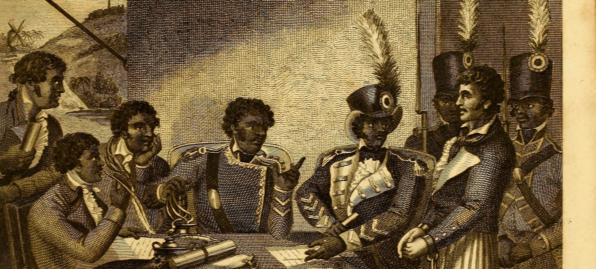
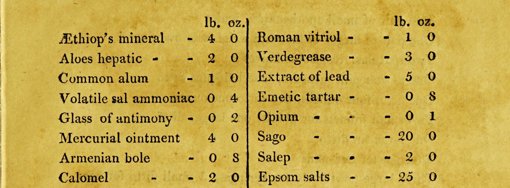
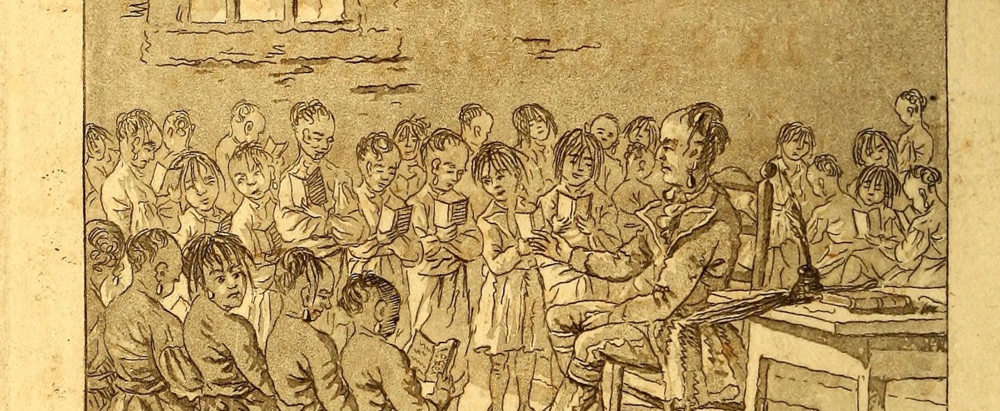

In the early modern world, how did printed texts convey to European audiences ideas about race and indigeneity in the Americas? What methods, tropes and devices did they employ to introduce, transmit, and perpetuate ideologies? These are just some of the questions prompted by the exhibition *Controlling Colonial Impressions: Representations of Race and Indigeneity in the Early Americas.* Launched in conjunction with Brown University’s *Sawyer Seminar on Race and Indigeneity in the Americas,* this exhibition explores these topics through the medium of books, which became a primary vehicle for the dissemination of knowledge about the Americas to audiences in early modern Europe.

Curated collectively by undergraduate students in History 1954J: History of the Book in the Americas, it is organized thematically into four sections: *Imagining and Imaging Colonial Subjects,* an exploration of depictions of race and identity within the realm of the visual; *‘Objective’ Texts: Race and Indigeneity in Scientific Books,* which examines the appropriation of science in the service of empire-building; *The Iconography of Race in the British Atlantic,* which treats race as a way of seeing; and *Means of Control,* a study of text as an instrument to assert power and dominance. Each section bears witness to conceptions of race in flux, tensions between the exotic and the recognizable, nearness and distance, as well as economic expediency and the erasure of identities.

*Controlling Colonial Impressions* is open to the public at the John Carter Brown Library, May 15 - July 1, 2019. This digital companion was published in May 2019.

# Explore the Exhibition by Theme

[{: .align-left }{: height="100px" width="300px"}](iconography/)

## [Section 1:   Iconography of Race in the British Atlantic](iconography/)
Curated by Will Evans, Hal Triedman & Zoe Zimmermann
 
 

[{: .align-left }{: height="100px" width="300px"}](objectivity/)

## [Section 2: “Objective” Texts:  Race and Indigeneity in Scientific Books](objectivity/)
Curated by N. Allen, Mark Chih-Wei Liang & Jamie Solomon
 
 

[{: .align-left }{: height="100px" width="300px"}](imaging/)

## [Section 3:  Imagining and Imaging Colonial Subjects](imaging/)
Curated by Tobias Berggruen, Sean Briody & Caroline Mulligan
 
 

[{: .align-left }{: height="100px" width="300px"}](controlling/)

## [Section 4:  Means of Control](controlling/)
Curated by Hannah Alpert-Abrams, Neil Safier & Stijn van Rossem
 
 

# Explore the Exhibition by Time
<iframe src='https://cdn.knightlab.com/libs/timeline3/latest/embed/index.html?source=1HvA4m1kTl50k0G3wUaNPE4C9BW5Up5S75BtdHxezwAw&font=Default&lang=en&initial_zoom=2&height=650' width='100%' height='750' webkitallowfullscreen mozallowfullscreen allowfullscreen frameborder='0'></iframe>

# About This Exhibition
This exhibition was curated by undergraduate students in HIST 1954J: The History of the Book in the Americas and Beyond (Spring, 2019), taught by Neil Safier, Stijn van Rossem, and Hannah Alpert-Abrams. It was designed as a companion to the Sawyer Seminar on Race and Indigeneity in the Americas. It benefitted from the support of John Carter Brown Library staff Tara Kingsley and Gabriela P. Cantú (programming and outreach), John Minichiello and Donna Dorvick (digitization), and Valerie Andrews, Kim Nusco, and Samara Ayvazian-Hancock (research and reference).

Curators: Nathan Allen, Tobias Berggruen, Sean Briody, Will Evans, Mark Chih-Wei Liang, Caroline Mulligan, Jamie Solomon, Hal Triedman, & Zoe Zimmermann.

<!-- <figure class="align-center">
  
  <figcaption><a href="/exhibition/home"> Enter "Controlling Colonial Impressions"</a></figcaption>
</figure>  -->

<!--  -->

<!-- ![woodcut of students in a classroom]

[woodcut of students in a classroom]: /images/exhibit/primer.jpg
{: width=50%} -->

